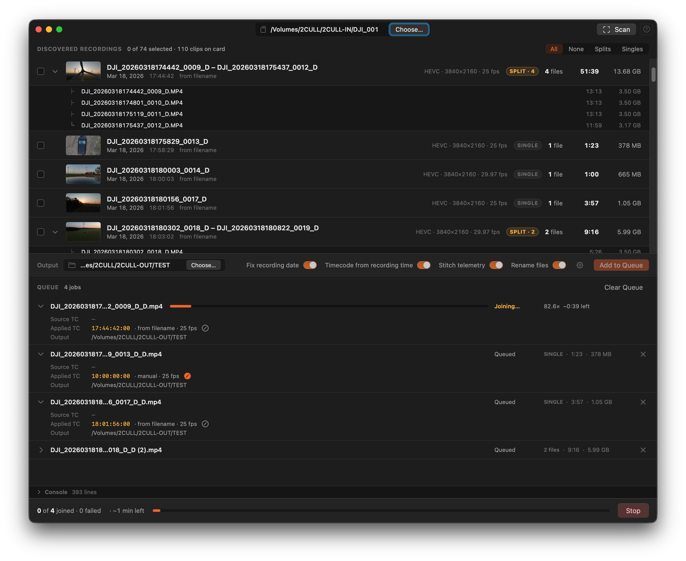

# Dates and Timecode

## Why the embedded date is wrong

DJI cameras write `creation_time` in the video container, but the value is often local time labeled as UTC (no timezone conversion). On some models it's missing entirely. Copying files to another drive resets the filesystem modification date. The result: the date you see in Finder or an NLE is usually wrong.

## How Conjoyn derives the correct date

Conjoyn checks three sources in priority order:

1. **Filename** — the modern DJI filename encodes the local recording start as `DJI_YYYYMMDDHHMMSS_NNNN_D.MP4`. This is the most reliable source because it's set by the camera at the moment of recording and survives copying.
2. **SRT cue** — the `.SRT` telemetry sidecar's first subtitle timestamp. Used when the filename doesn't carry a timestamp (legacy `DJI_NNNN.MP4` naming).
3. **Embedded date** — the container's `creation_time` atom. Least reliable; used only as a last resort.

The origin tag shown under each recording name — `from filename`, `from SRT cue` — tells you which source was used.

## Timecode

The output file receives a `tmcd` (timecode) track seeded from the recording start. The sub-second portion of the start time determines the frame number.

The **Applied TC** shown in a queue row's disclosure panel is exactly the timecode that will be stamped — what you see is what gets written. The origin tag (`from filename`, `from SRT cue`, `manual`) tells you where it came from.

## Manual TC override

Expand any queue row's caret and click the pencil icon on the **Applied TC** line to enter a custom timecode. Type `HH:MM:SS:FF`, press **Enter** to confirm or **Esc** to revert. A manual override is session-only and doesn't affect the `creation_time` fix.
