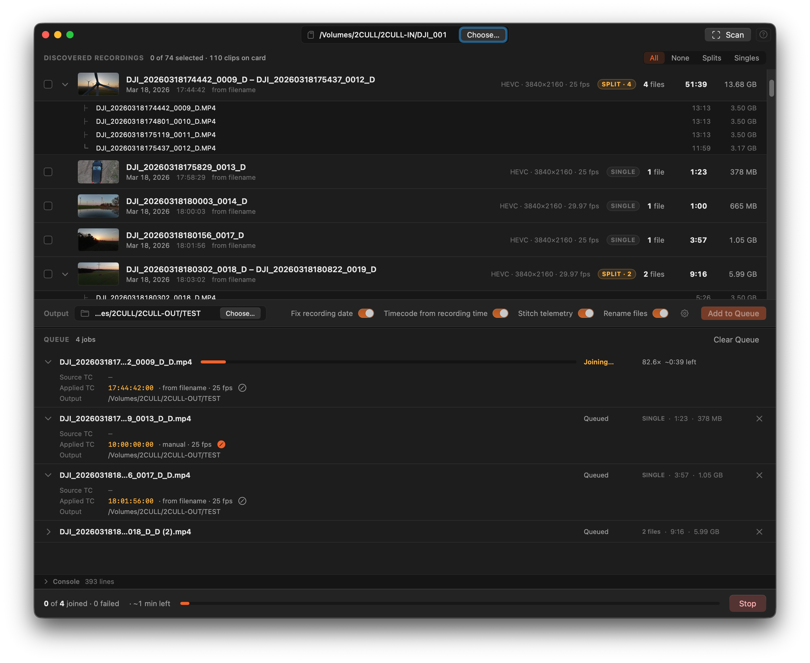

# Dates and Timecode

## Why the embedded date is wrong

Cameras write `creation_time` in the video container, but the value is often local time labeled as UTC (no timezone conversion). On some models it's missing entirely. Copying files to another drive resets the filesystem modification date. The result: the date you see in Finder or an NLE is usually wrong.

## How Conjoyn derives the correct date

Conjoyn checks these sources in priority order, taking the first one that yields a usable value:

1. **SRT cue** — the `.SRT` telemetry sidecar's first subtitle timestamp, a real wall-clock the camera wrote as it recorded. DJI only.
2. **Filename** — the modern DJI filename encodes the local recording start as `DJI_YYYYMMDDHHMMSS_NNNN_D.MP4`. Set by the camera at the moment of recording and survives copying. GoPro names carry no timestamp, so this step never applies to them.
3. **Embedded date** — the container's `creation_time` atom, used when it passes a sanity check that rejects the 1904/1951 QuickTime-epoch artifacts and far-future clock garbage. This is the normal source for GoPro footage, which writes neither of the signals above.
4. **File date** — the filesystem creation date. A last resort: trustworthy on a fresh card read, but a Finder copy resets it.

The origin tag shown under each recording name — `from SRT cue`, `from filename`, `from creation time`, `from file date` — tells you which source was used.

## Timecode

The output file receives a `tmcd` (timecode) track seeded from the recording start. The sub-second portion of the start time determines the frame number.

The **Applied TC** shown in a queue row's disclosure panel is exactly the timecode that will be stamped — what you see is what gets written. The origin tag (`from filename`, `from SRT cue`, `manual`) tells you where it came from.

## Manual TC override

Expand any queue row's caret and click the pencil icon on the **Applied TC** line to enter a custom timecode. Type `HH:MM:SS:FF`, press **Enter** to confirm or **Esc** to revert. A manual override is session-only and doesn't affect the `creation_time` fix.
