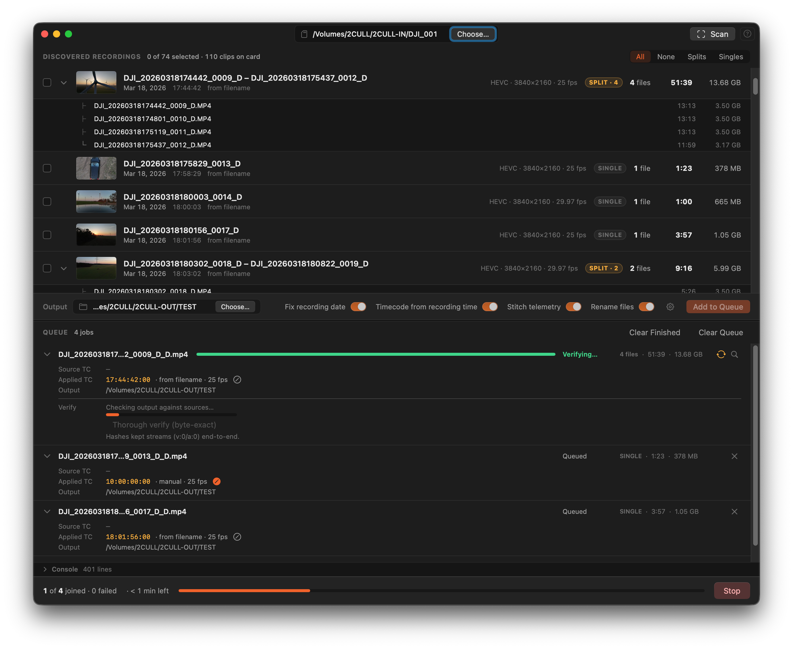
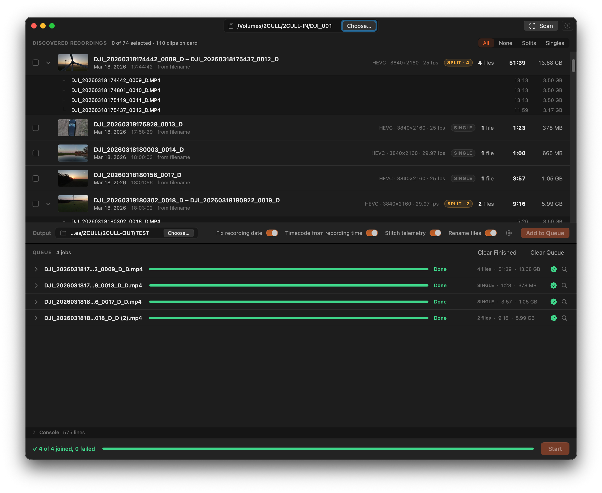

# Joining and Verification

## What happens during a join

Conjoyn uses FFmpeg's concat demuxer with `-c copy`. This re-muxes the container without re-encoding — the video and audio stream data is copied byte-for-byte. The result is lossless: the output is identical in quality to the source segments.

After the join, Conjoyn stamps:

- **`creation_time`** — the corrected recording date.
- **`tmcd` track** — the derived timecode.
- **`+faststart`** — the moov atom is moved to the front of the file for faster NLE ingest and streaming.
- **`.SRT` sidecar** — stitched from the source segment sidecars with corrected time offsets.

## Speed and ETA

Each active row shows the current processing speed (e.g. `80×`) and estimated time remaining. The footer shows the total remaining time for the whole queue.

## Verification

After each join, Conjoyn automatically runs a two-tier check:

**Tier 1 — fast container check:** Compares packet counts, byte sizes, duration, codec parameters, and A/V drift between the sources and the output. Runs in seconds.

**Tier 2 — byte-exact hashes:** Hashes every kept packet in v:0 and a:0 end-to-end across sources and output. Triggered automatically if Tier 1 finds any anomaly. Also available manually via the **Thorough verify** button in the row disclosure.

## The seal

Each finished job shows a seal icon:

- **Green ✓** — all checks passed. Output is verified.
- **Orange ⚠** — completed with a minor warning (e.g. duration rounded to the nearest frame). Expand the row for details.
- **Red ✗** — verification failed. Do not use this output; re-join and check the Console log.

