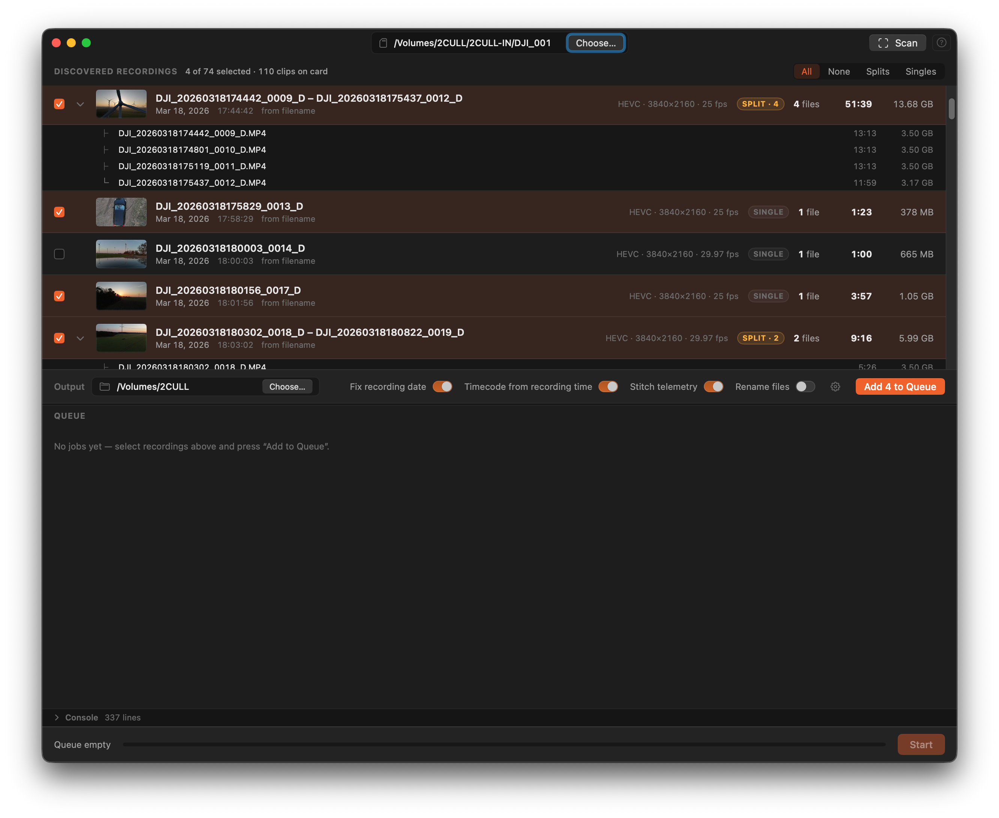

# Singles and Splits

## Split recordings

A split recording is two or more segments that came from one continuous press of the record button. DJI cameras split at around 4 GB to stay within the FAT32 filesystem limit.

These are the files Conjoyn was built for. Joining them produces a single lossless file with accurate metadata. The orange **SPLIT · N** badge shows how many segments are in the group.

## Single recordings

A single recording is a lone clip that never hit the 4 GB limit. No joining is necessary, but you can still queue a single to apply the recording-date fix, stamp a timecode track, and carry over its `.SRT` sidecar.

An orange **SINGLE** badge means the clip has an integrity note — hover the badge to see what was detected.

## Filtering the list

The buttons at the top right control which recordings are visible:

| Button | Visible rows | Auto-selects |
|--------|-------------|--------------|
| **All** | Every recording | All |
| **Splits** | Split groups only | All splits |
| **Singles** | Single clips only | All singles |
| **None** | No change | Deselects all visible |

Clicking **Splits** or **Singles** also selects all matching rows so you can add them to the queue in one click.

## Slow-motion clips

Clips recorded at a high frame rate (e.g. 100 fps) are stored in a 25 fps container — so the file plays back at 4× the real recording time. Conjoyn detects this from the `.SRT` telemetry and shows a **slow-mo** badge. The timecode is stamped at the real recording start and advances at the file's playback rate (25 fps), which is what NLEs expect.
