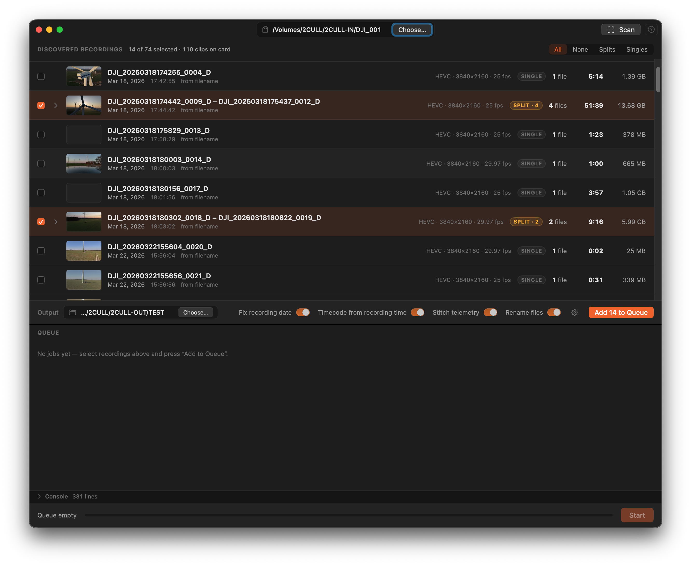

<div align="center">

# conjoyn

**Auto-stitch split DJI drone clips back into one lossless file — on your Mac.**

DJI drones chop a long recording into ~4 GB MP4 segments (`DJI_0001.MP4`, `DJI_0002.MP4`, …).
Conjoyn finds the segments that belong together, joins them **without re-encoding**, fixes the
date/timecode metadata, and re-times the `.SRT` telemetry sidecar — so you get back the single
clip your drone actually recorded.




</div>

---

## Why

When you copy footage off an SD card, a single long shot arrives as several numbered MP4 files.
Stitching them by hand in an NLE means a re-encode (quality loss + time) or fiddly concat commands,
and the joined file usually ends up with the wrong creation date and a broken telemetry track.

Conjoyn does it the right way:

- **Lossless.** Joins with FFmpeg's concat demuxer using `-c copy` — your video and audio streams
  are copied bit-for-bit. No re-encode, no generation loss, near-instant.
- **Smart grouping.** Segments are grouped by *metadata continuity* (embedded `creation_time` +
  duration + filename order), **not** just filenames — and camera variants (`_W`/`_T`/`_Z` wide /
  tele / zoom, etc.) are never merged together.
- **Correct metadata.** The output carries the real recording start date and timecode, with any
  date↔timecode discrepancy surfaced for you to confirm.
- **Telemetry preserved.** The `.SRT` sidecar (GPS, altitude, gimbal, exposure) is stitched back
  together with corrected time offsets — when one is present.

## Features

- 🎬 One-click join of split recordings, grouped automatically
- 🧬 Lossless concat (`-c copy`) — no re-encoding, ever
- 🗓️ Date + timecode metadata fix, with manual timecode override
- 🛰️ `.SRT` telemetry stitching with re-timed offsets
- ✅ Source↔output verification with integrity flags (codec/res/fps mismatch, gaps, slow-mo)
- 📊 Sortable recordings list, live ETA / speed, single-file export
- 🌗 Light / Dark / Match-System appearance, runtime Dock-icon switch
- 🔄 Built-in auto-update (Sparkle)
- 🔒 Direct distribution, **signed & notarized** by Apple

> **Works with just the MP4s.** SRT sidecars are optional — if you only copied the video files,
> Conjoyn still discovers, groups, and losslessly joins them. The SRT step is simply skipped when
> there's nothing to stitch.

## Requirements

- macOS **14.0 (Sonoma)** or later
- **Apple Silicon** (arm64)

## Download

Conjoyn is distributed directly as a signed, notarized `.dmg` — no Mac App Store, no Gatekeeper
prompt. Grab the latest release from **[conjoyn.lucesumbrarum.com](https://conjoyn.lucesumbrarum.com)**.
The app updates itself from there via Sparkle.

## Build from source

The repo is the full app source. The FFmpeg binaries are **not** committed (they're large and
reproducibly built) — fetch or build them first.

```bash
# 1. Project generator + FFmpeg
brew install xcodegen
01_Project/scripts/fetch-ffmpeg.sh          # or build-ffmpeg-lgpl.sh to build LGPL FFmpeg yourself

# 2. Generate the Xcode project and open it
cd 01_Project
xcodegen generate
open Conjoyn.xcodeproj
```

Then build & run the **Conjoyn** scheme. macOS 14 SDK / Xcode 16+.

## How it works

| Stage | What happens |
|-------|--------------|
| **Discover** | Scan a folder (e.g. `DCIM/100MEDIA`); read each clip's duration + embedded metadata via AVFoundation, with an `ffprobe` fallback. |
| **Group** | Chain segments by `creation_time` continuity, filename order, and stream-parameter match. Camera variants are kept apart. |
| **Join** | `ffmpeg -f concat -safe 0 -i list.txt -c copy -fflags +genpts -movflags +faststart -y out.mp4` |
| **Fix** | Write the corrected `creation_time` and timecode atoms back to the output. |
| **Telemetry** | Concatenate the per-segment `.SRT` cues with cumulative time offsets. |
| **Verify** | Compare source vs. output and raise integrity flags before declaring success. |

## Tech

SwiftUI · Swift 6 · MVVM · AVFoundation · a bundled, statically-linked **LGPL** build of FFmpeg 8.x.
The app runs **without the App Sandbox** (Hardened Runtime enabled) so it can drive the bundled
FFmpeg, which is why it ships via direct distribution rather than the Mac App Store.

### FFmpeg

Conjoyn bundles FFmpeg under the **LGPL** (no GPL/nonfree components). The binaries are built
reproducibly by `01_Project/scripts/build-ffmpeg-lgpl.sh` and are not part of this repository.

## License

Licensed under the **[PolyForm Noncommercial License 1.0.0](LICENSE.md)**.

You're free to read, fork, modify, and share the code **for non-commercial purposes** — personal
use, study, hobby projects, research, education. **You may not use this code (or a derivative of it)
for a commercial purpose**, including selling it or shipping it as part of a paid app. This is a
source-available, non-commercial license — not an OSI "open source" license.

---

<sub>Conjoyn is an independent project and is **not affiliated with, endorsed by, or sponsored by
DJI**. "DJI" and related marks are trademarks of their respective owners. Copyright © 2026 Luces
Umbrarum.</sub>
